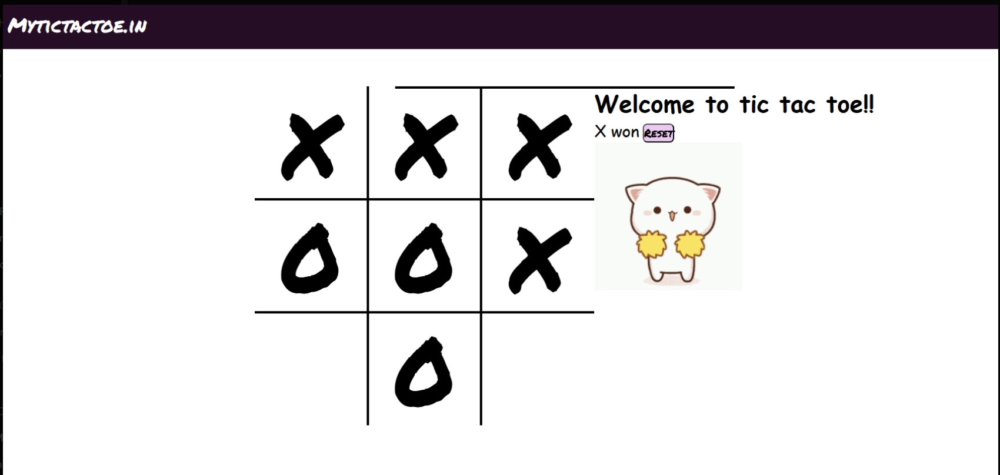

# 🎮 MyTicTacToe.in

Welcome to **MyTicTacToe.in** – a fun, interactive, and visually engaging Tic Tac Toe game made with pure **HTML, CSS, and JavaScript**. Enjoy unique sounds, animations, and a custom design as you play one of the most classic games ever!


---

## 🧩 Features

- 🟢 **Two-Player Mode**: Play with a friend on the same device.
- 🔊 **Sound Effects**: Different sounds for move, win, and game over.
- 🐱 **Winner Animation**: A cute cheer cat GIF appears when someone wins.
- 🌀 **Responsive Layout**: Works well across screen sizes.
- ♻️ **Reset Button**: Restart the game instantly.

---

## 📁 Project Structure

```
MY-TIC-TAC-TOE-MASTER/
├── index.html        # Main HTML file
├── style.css         # Game styling
├── script.js         # Game logic
├── excited.gif       # Winner animation
├── music.mp3         # Background music
├── ting.mp3          # On move sound
├── gameover.mp3      # Game over sound
├── Glassi.mp3        # Additional effect
```

---

## 🚀 How to Run

### Option 1: Open Locally
1. Clone or download the repository
2. Open `index.html` in your browser

### Option 2: Use Live Server (Optional)
- Install [Live Server Extension](https://marketplace.visualstudio.com/items?itemName=ritwickdey.LiveServer) in VS Code
- Right-click `index.html` → Click **"Open with Live Server"**

---

## 📸 Screenshot


---

## 📬 Connect with Me
- 💼 [LinkedIn](https://www.linkedin.com/in/arpit-gupta-95b5a2250/)
- 🧑‍💻 [GitHub](https://github.com/ArpitGupta4957)
- 🌐 [Portfolio](https://arpit-gupta-portfolio.vercel.app/)

---

## 📝 License
This project is licensed under the **MIT License** – feel free to use and modify it.

Enjoy the game and feel free to customize it! 🕹️
